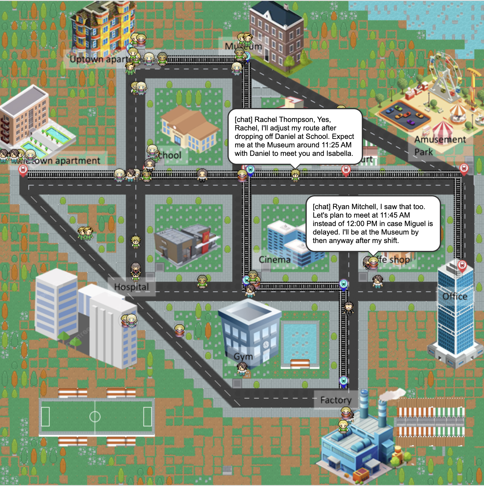
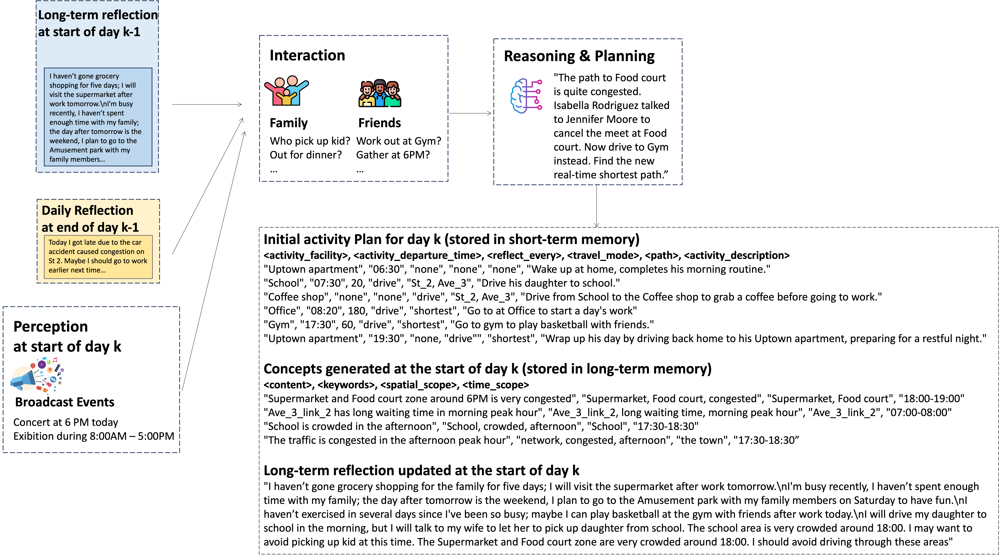
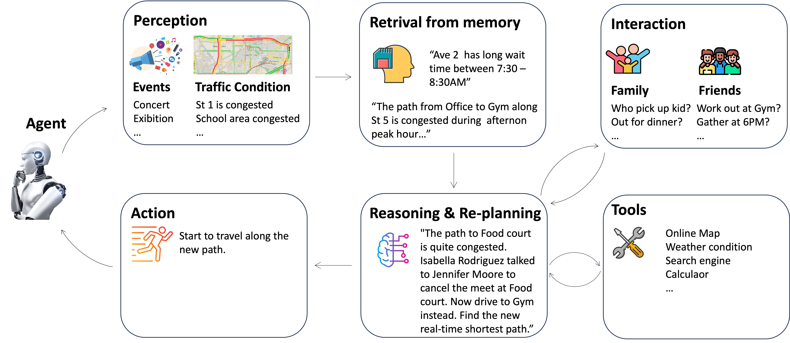
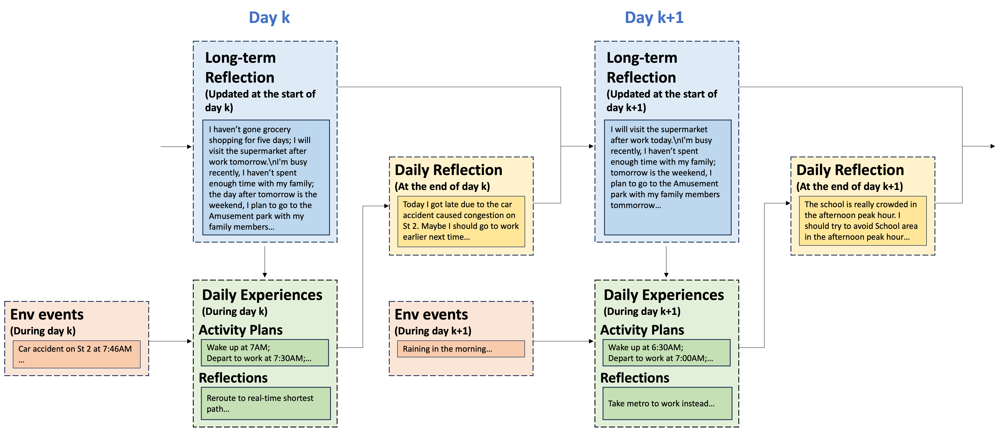
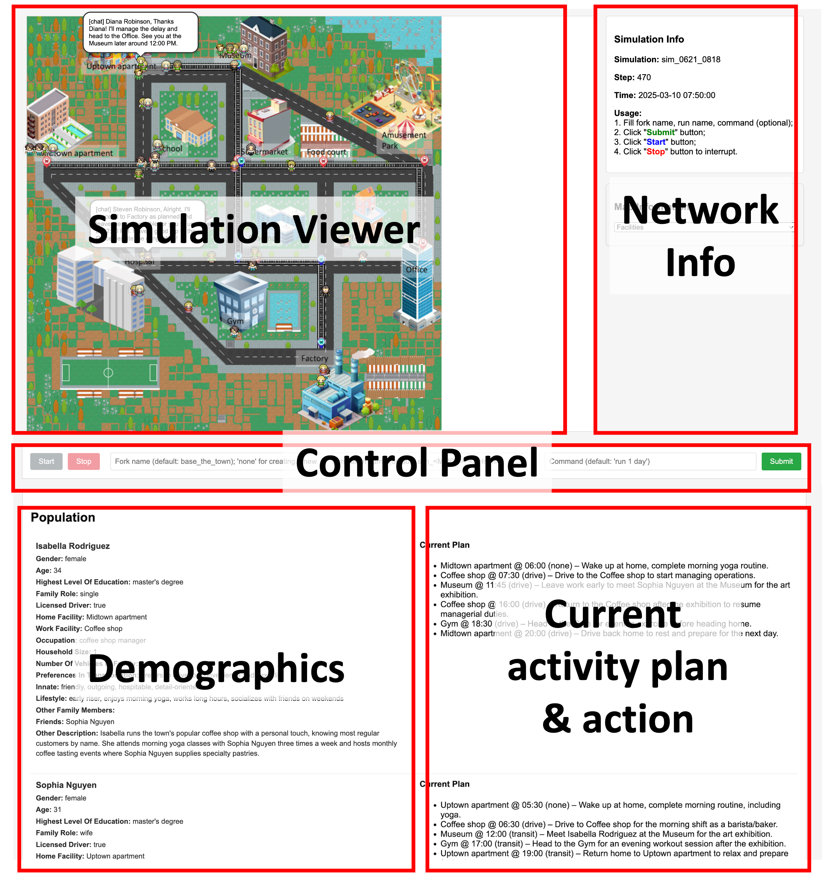
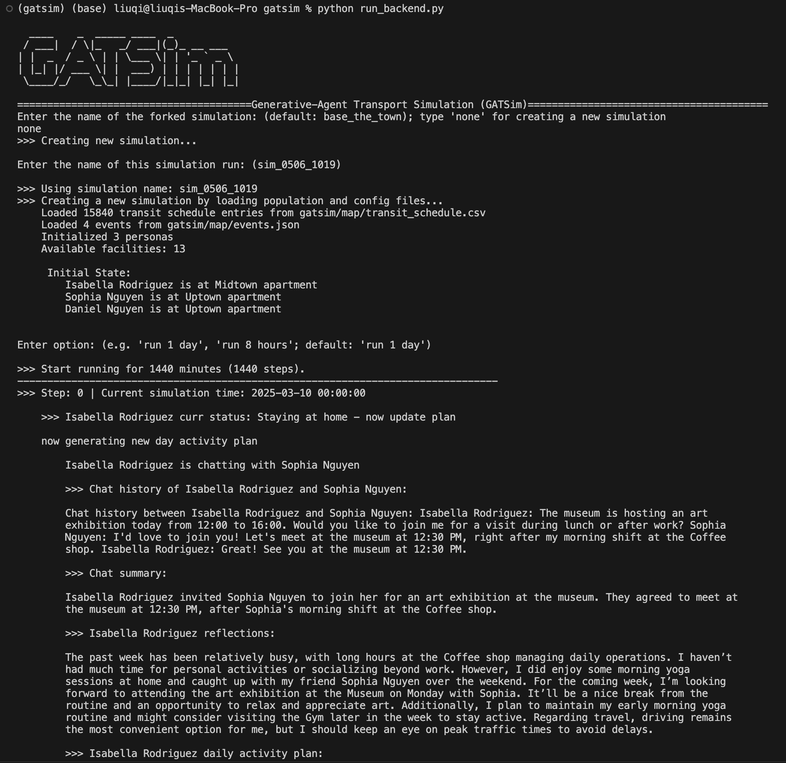

# GATSim: Generative-Agent Transport Simulation

[](https://discord.gg/7qPv9TGg)[](LICENSE)




GATSim is a novel framework that leverages generative agents 🤖 to simulate urban transportation systems. Unlike traditional rule-based approaches, GATSim creates autonomous agents capable of human-like decision-making in complex mobility scenarios.

This is an ongoing project that is continuously being improved. It is open-sourced under the `Apache 2.0` license, and contributions from practitioners are warmly welcome!


## Overview
This prototype implementation enables generative agents 🤖 in urban simulation environment to:
 - **Perceive** surrounding events/family members & friends state/traffic conditions;
 - **Interact** with family members, friends, and other agents
 - **Remember** with long-term/short-term memory;
 - **Plan** daily activities and adapt schedules dynamically;
 - **Reflect** on travel experiences to improve future decisions;
 - **React** to to unexpected events and changing traffic patterns by re-routing, changing departure time, revising activity plan, etc.

This project is inspired by the work of Park et al. (2023) [Generative Agents](https://arxiv.org/abs/2304.03442).


### Motivation
Agent-based simulation has long been a cornerstone of complex systems modeling. Traditional frameworks like MATSim rely on predefined behavioral rules and utility functions to simulate human mobility patterns. While effective, these rule-based approaches struggle to capture the nuanced, adaptive nature of human decision-making. GATSim represents a paradigm shift by employing Large Language Model (LLM)-powered agents that can:
- Make context-aware decisions without explicit programming
- Learn from experiences and adapt behaviors naturally
- Generate realistic responses to novel situations
- Exhibit emergent behaviors that mirror human mobility patterns

### Applications
GATSim enables new possibilities for:
- **Transportation Planning**: Test infrastructure changes and policy interventions
- **Traffic Management**: Evaluate real-time traffic control strategies
- **Behavioral Studies**: Understand how people adapt to new mobility options
- **Scenario Analysis**: Simulate responses to disruptions or emerging technologies
- **Urban Design**: Assess the impact of land-use changes on travel patterns

By bridging the gap between individual intelligence and collective dynamics, GATSim offers a more naturalistic approach to understanding and optimizing urban mobility systems.

### Contributors
Qi Liu, Can Li, Wanjing Ma
MAGIC Lab, College of Transportation, Tongji University

### How to cite
>[TDB]


## ✨Key Features

👉 See more technical highlights at [Technical Highlights](technical_highlights/README.md)

👉 See research results at [Research Results](research_results/README.md)

Agent in this prototype supports the the following functions:


Concurrent LLM call is supported to speed up simulation process.

**💡Agent Long-term Activity Planning Process**
Each agent generates an initial activity plan at the beginning of the day. The overall planning process is illustrated below. The agent first receives contextual inputs, which include (1) long-term reflections from the previous week, (2) daily reflections from the previous day, and (3) perceived broadcast events

Using this context, the agent may initiate conversations with relevant parties to collaboratively plan the day. For instance, a husband agent might discuss school pick-up responsibilities with his spouse, or an agent might coordinate a post-work gym session with a friend.

The final step in the process involves reasoning and planning. The planning phase outputs three elements: (1) an initial activity plan, (2) a set of concept nodes, and (3) an updated long-term reflection.



**🤖Agent Reaction to Real-time Events Process**
One of the key advantages of generative agents is their ability to flexibly and naturally respond to real-time traffic conditions and unexpected incidents.




**🧠Agent Reflection Process**
Reflection is the process through which an agent internalizes its daily experiences, gradually forming preferences, habits, and abstract knowledge.

Long-term reflections summarize key personal experiences over the past week, encompassing work-related tasks, social interactions, and family affairs. These reflections also contain brief anticipations of upcoming events.




**📺 Demo Video**
**Simulation running demo**
[Demo](assets/gatsim_demo2.mp4)


**Examples of agent flexible reactive behaviors**
```
Name: George Wright | Time: Thu 2025-03-13 07:28
 I experienced a 9-minute wait at Metro_1_link_1 this morning, which was unexpected and slightly delayed my arrival at the Office. While there is currently only light congestion on Ave_2_link_2 and moderate congestion on Ave_1_link_1, the earlier-than-expected delays on Metro_1 suggest potential variability in transit reliability today. This could affect my ability to comfortably return from the Museum visit during lunch if similar conditions occur on my outbound trip back to Office. However, since no major disruptions are reported and my travel mode remains consistent, I will maintain the current plan with minor timing adjustments.
Plan revisions: George Wright update the departure time of next activity at Museum to 12:45

Name Michael Chen | Time: Thu 2025-03-13 14:05
I am currently at Supermarket, having arrived at 12:40 for a planned 10-minute trip. However, I have been waiting for 80 minutes due to unforeseen queuing delays. This significantly impacts my schedule, particularly the upcoming meeting with Gloria Campbell at Office. Since there is no congestion in the road network and my travel time from Supermarket to Office is only 10 minutes by car, I can still make the originally scheduled 13:15 departure time if I leave now. Given my profession as a museum curator and the importance of finalizing exhibit details with Gloria, it's essential to maintain this meeting.
Plan revisions: Michael Chen update future activity plan:
[['Office', '14:10', 120, 'drive', 'Ave_2_link_3, St_4_link_1', 'Arrive at Office by 14:20 to meet with Gloria Campbell and finalize exhibit design details.'], ['Gym', '17:45', 60, 'transit', 'Metro_1', 'After work, take Metro_1 from Node_8 to Node_13 and transfer to visit Gym for light training and relaxation.'], ['Uptown apartment', '19:30', 'none', 'transit', 'Metro_2', 'Return home via Metro_2 to Node_1 and spend quiet evening with family before bedtime.']] 

Robert Johnson | Time: Thu 2025-03-13 07:01
I am currently en route to the Gym from Midtown apartment, but there is moderate congestion on St_1_link_2, where David Martinez is already experiencing a 5-minute delay. Although I have not yet encountered this link in my current trip, my planned path includes it, which could impact my punctuality. Given that my work as a fitness instructor requires me to be present early for morning classes, avoiding delays is crucial. Fortunately, alternative routes like using St_2_link_1 and Ave_2_link_2 are available, which bypass the congested area.
Plan revisions: Robert Johnson update current path to ['St_2_link_1', 'Ave_2_link_2'] 

Gloria Campbell | Time: Thu 2025-03-13 07:13
I am currently en route to work on the Factory, departing from Midtown apartment at 07:00. However, I have just encountered severe congestion on St_1_link_1 (Node_4 -> Node_9), with a wait time of 16 minutes reported. This will delay my arrival at the Factory unless I adjust my travel path. My original plan was to take Ave_4 and St_4, which is still viable if I can reroute efficiently to avoid further delays.
Plan revisions: Gloria Campbell update current path to ['Ave_2_link_1', 'Ave_2_link_2', 'St_3_link_1'] 

Christopher Evans | Time: Thu 2025-03-13 08:25
I am currently at the Coffee shop, where I have been discussing client training schedules with Benjamin Taylor. The current traffic state shows no congestion across any links in the network, which is a positive change from earlier delays on Ave_4_link_1 and St_1_link_2. This improved traffic condition allows for more flexibility in my upcoming travel plans. According to recent perception updates, Benjamin will remain at the Gym until at least 08:30 working with clients, so I plan to meet him there by 08:25 as previously coordinated. Since there is no ongoing congestion, I can proceed with confidence along the shortest available path to the Gym.
Plan revisions: Christopher Evans update current path to real-time shortest
```

**Examples of agents gaining new knowledge through reflections on every day travel experiences**
```
Name: Rachel Thompson | Date: Thu 2025-03-13 AM
This week has been a balance of managing the Cinema's operations and coordinating community events with Isabella Rodriguez. Yesterday's traffic disruptions on St_1_link_2 highlighted the need to proactively adjust evening routes, especially when coordinating with Marcus for post-work plans.

Hannah Wilson | Date: Thu 2025-03-13 AM
Traffic was mostly clear throughout the day, with only minor delays on Ave_4_link_1 and St_1_link_2. Today, I need to maintain flexibility while ensuring punctuality for work and social commitments. I'll prioritize leaving early enough to avoid potential congestion on St_3_link_2 and ensure smooth coordination with Brian and Frank for post-work activities.

Rebecca Lee | Date: Thu 2025-03-13 AM
My early morning workout routine at the Gym has proven effective not only for maintaining fitness but also for avoiding peak traffic, particularly on St_1_link_2, which tends to be congested during morning hours. Yesterday's adjustment to an alternative route via St_4_link_2 and Ave_3_link_3 was successful, highlighting how critical it is to stay aware of recurring congestion patterns and have contingency plans in place.

Patricia Johnson | Date: Thu 2025-03-13 AM
The past week has been a balance of work, family coordination, and personal commitments. I've successfully adjusted my commute routes to avoid congestion on St_1_link_2 and St_1_link_1, which has improved my punctuality at the Factory.

Michelle Harris  | Date: Thu 2025-03-13 AM
I've learned to adjust my routines to avoid traffic bottlenecks by leaving earlier and using alternative routes like Ave_2 during morning commutes. The evening meetup with Elizabeth at Coffee shop worked well as an alternative to the Gym, especially since the Gym tends to be crowded before 20:30.
```

**Traffic state visualization**
A traffic state visualizer tool is provided: `traffic_state_animator.py`. Demo video:
[Demo](assets/gatsim_demo2.mp4)


## 📢News
Upcoming Features & Contributions


## Project Structure
```
[project_root]/
├── create_map/                         # Scripts to create map
├── create_population/                  # Prompts and scripts to create population
├── frontend/                           # Frontend of the project (Django)
├── gatsim/                             # Main package directory
│   ├── agent/                          # Agent module
│   │   ├── cognitive_modules/          # Cognitive modules of agent
│   │   │   ├── perceive.py             # Perceive module
│   │   │   ├── plan.py                 # Plan module
│   │   │   └── reflect.py              # Reflect module
│   │   ├── llm_modules/                # LLM modules of agent
│   │   │   ├── prompt_templates/       # all prompts stored here
│   │   │   ├── llm.py                  # LLM APIs
│   │   │   └── run_prompt.py           # script to run prompt with arguments
│   │   └── memory_modules/             # Memory modules of agent
│   │       ├── long_term_memory.py     # Long-term memory module
│   │       └── short_term_memory.py    # Short-term memory module
│   ├── cache/                          # Store dynamic info to be display by frontend
│   ├── map/                            # Network of the simulation world
│   │   └── maze.py                     # Network class
│   ├── storage/                        # Persistent storage of the simulation process
│   │   └── [simulation_name]/          # Simulation result folder
│   │       ├── meta.json               # Simulation meta data
│   │       ├── personas/               # Persona memory folder
│   │       │    ├── [persona_name]/
│   │       │    │      ├──short_term_memory.json
│   │       │    │      └──long_term_memory.json
│   │       │    └── ...
│   │       └── movements/              # Simulation movements folder
│   │           ├── 0.json              # Movement data at step 0
│   │           └── ...
│   ├── backend.py                      # Backend program / simulation core
│   ├── config.py                       # Configuration file
│   └── utils.py                        # Utility functions
├── run_backend.py/                     # Backend entry point
├── run_frontend.py/                    # Frontend entry point
├── traffic_state_animator.py/          # traffic state animation visualizer tool
├── traffic_state_snapshot.ipynb/       # tool to capture the traffic state
├── technical_highlights/               # Technical highlights  
└── research_results/                   # Research results   
```

## 📲Setup environment
 - Create conda environments

```conda create -n gatsim python=3.9 -y```

 - Install dependencies

```pip install -r requirements.txt```

 - Install the package

```pip install -e .```

 - Config the LLM (Optional)
By default, this project make use of [Qwen 3](https://qwenlm.github.io/blog/qwen3/) model with OpenAI chat completions API. You can apply for the API key from https://bailian.console.aliyun.com/#/home . Optionally, you can revise the model to other LLM (e.g. GPT-4o) by modifying the following code block from `gatsim/config.py`.

```
client = OpenAI(
    api_key=os.getenv("DASHSCOPE_API_KEY"),
    base_url="https://dashscope.aliyuncs.com/compatible-mode/v1",
)
```

 - Setup LLM API key
Create .env file in the project root directory. Add the following line to the .env file:

```DASHSCOPE_API_KEY=[your qwen api key]```


## ⚙️Quick start
A backend and web UI for the simulation are provided.


### 🚀Run web UI
How to run the web UI:

First, change directory to the project root ```GATSIM/```. Then run

```python run_frontend.py runserver```

Then you can visit the web UI at ```http://127.0.0.1:8000/```

 - **Web UI Layout**



### 🎯How to use

**Try the example simulation environment**
 - Click "Submit" button;
 - Click "Start" button.
 - Click "Stop" to interrupt (simulation run in background; DO NOT interrupt directly by pressing "Ctrl+C").

**Customize your own simulation environment**
You can customize the simulation environment by revising the following files:
 -  `[root]/gatsim/agent/population_info.json`; folder `[root]/create_population/` contains the prompt for creating population;
 -  `[root]/gatsim/map/nodes_info.json`, `[root]/gatsim/map/facilities_info.json`, `[root]/gatsim/map/links_info.json`; these files define the map; folder `[root]/create_map/` contains the scripts and tileset to help you to create the map;
 - `[root]/gatsim/map/events_info.json`; this file defines the event like car accident, lane closuse, etc. Modify this file to create a new simulation scenario;
 - `[root]/gatsim/config.py` to set the simulation parameters.

**Run new simulation environment for the first time**
For the first run of a new simulation, you follow the following steps:
 - Fill run name (default to sim_[datetime]), command like "run 1 day" (default to run 1 day);
 - Click "Submit" button;
 - Click "Start" button.
 - Click "Stop" to interrupt.

**Continue a simulation**
 - Fill fork name (the run you want to continue), new run name (default to sim_[datetime]), command like "run 1 day" (default to run 1 day);
 - Click "Submit" button;
 - Click "Start" button.
 - Click "Stop" to interrupt.


### 👨‍💻Run backend
If you only need the simulation results, you can only run the backend server:

First, change directory to the project root. Then run
```python run_backend.py```




**Notes on stdout**
By default, the standard output of the simulation process is redirected to a file named `[root]/terminal_output.txt` (configurable in `[root]/gatsim/config.py`). 

If you want to see the standard output shown in the terminal, you can change the variable  `output_redirect_to_file` in file `[root]/gatsim/config.py` to be `False`.

**Notes on backend and frontend**
`[root]/gatsim/agent` contains the simulation agent scripts;

`[root]/gatsim/backend` loads the map and population; starts the simulation loop; saves results to `[root]/gatsim/storage` and updates dynamic visual elements information in `[root]/gatsim/cache`;

`[root]/frontend` is independent from the simulation backend; it loads the dynamic visual elements information from `[root]/gatsim/cache` and update the frontend accordingly; you can customize the frontend to your own needs, or you can embed the backend into your own frontend.

**Notes on concurrent LLM calling**
The simulation backend is designed to handle concurrent LLM calls. By default, 8 concurrent calls are allowed. You can adjust this number by modifying the `max_planning_threads` constant in `[root]/gatsim/config.py`. 
Beware of the token rate limit of your LLM model. Every additional concurrent call will consume ~ 70K more tokens consumption per minute for our simple example.


## 🥂 Contributing to GATSim
We greatly appreciate your interest in contributing to our open-source initiative. 


## 📬 Community & Contact
If you're keen on discoveries with our platform and wish to dive deeper or suggest new features, we're here to talk. Feel free to get in touch for more details by contacting Qi Liu (liuqi_tj@hotmail.com).