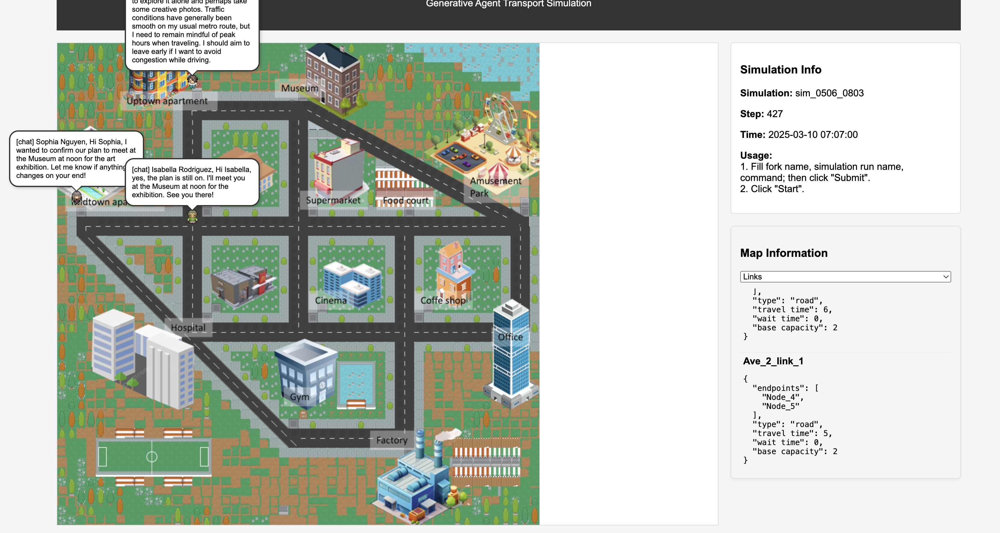
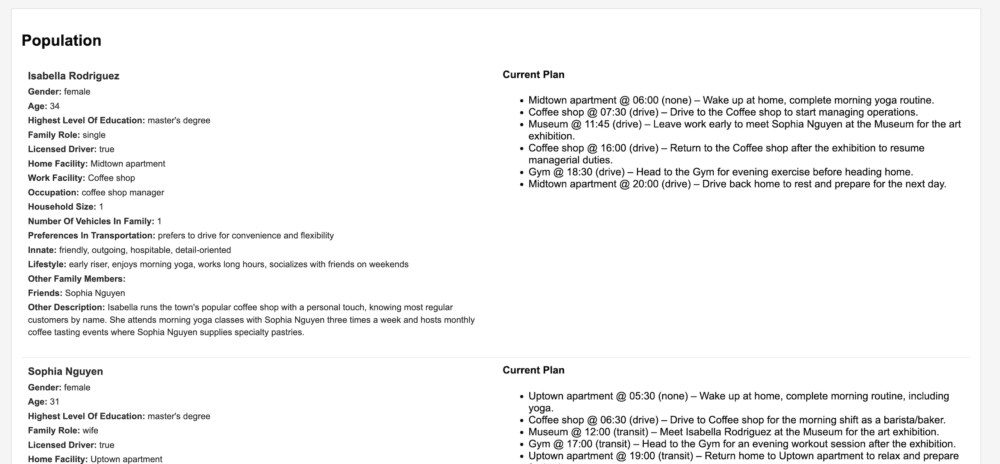

# GATSim: Generative-Agent Transport Simulation

## Introduction
Agent is a generative agent that can perceive the surroundings and interact with the family members and friends, and schedule activity plans, and take actions.

Agent has the following modules:
 - perceive
 - memory (long term memory/ short term memory)
 - reflect
 - plan
 - act


## Quick start
A backend and web UI for the simulation are provided.

## Setup environment
Create conda environments:

```conda create -n python=3.9 -y```

Install dependencies:

```pip install -r requirements.txt```

Install the package:

```pip install -e .```

### Run Web UI
How to run the web UI:

First, change directory to the project root ```GATSIM/```. Then run

```python run_frontend.py runserver```

Then you can visit the web UI at ```http://127.0.0.1:8000/```





### Run backend
If you only need the simulation results.  Run the backend server:

First, change directory to the project root ```GATSIM/```. Then run
```python run_backend.py```


