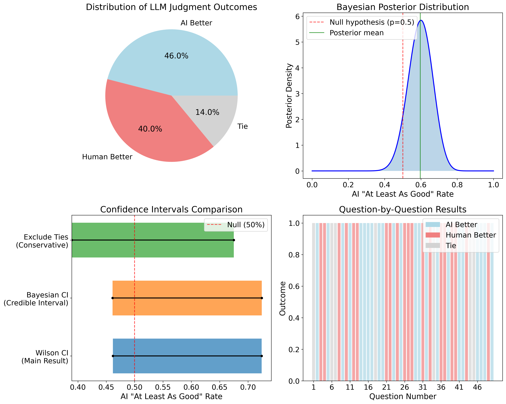

# Research Results

## Experiment 1: microscopic validation

**Step 1: prepare scenarios**

See ``experiment_1_questions_with_context/''.

**Step 2: Generate AI agent responses**

See ``experiment_1_generate_answers.py'' for the script.

Results are stored at ``experiment_1_answers.json''.

**Step 3: Evaluate responses (LLM as a Judge)**

See ``experiment_1_llm_judge.py'' for the script.

Results are stored at ``experiment_1_judgements.json''.

**Step 4: Statistical analysis**

See ``experiment_1_statistical_results.py'' for the script.

We conducted rigorous statistical analysis to validate the significance of observed performance differences. First, we tested whether the LLM judge performed better than random assignment using the null hypothesis $H_0$: generative agents win $\leq$ 33.3\% of comparisons (treating ties as 0.5 wins for each side). A binomial proportion test yielded $p = 0.002$, demonstrating that the judging process produces significantly non-random results.

Next, we examined whether generative agents significantly outperform human annotators using a sign test with $H_0$: $p_{\text{AI}} \leq 0.5$ versus $H_1$: $p_{\text{AI}} > 0.5$. The resulting $p$-value of 0.380 indicates we cannot reject the null hypothesis of equal performance. Namely, generative agents do not perform significantly better than human annotators. However, Bayesian analysis suggests a 92.0\% posterior probability that generative agents perform at least as well as human annotators, providing strong evidence for competitive behavioral realism (Figure~\ref{fig:test}).

## Experiment 2: macroscopic validation

This experiment examines emergent microscopic traffic patterns. The simulation beginning Monday, March 10, 2025 and last for three simulation days. The virtual population consists of 70 adults, with 37 employed at factory and office locations, predominantly working 8:00–17:00 shifts. This temporal concentration of commute demand naturally generates two traffic peaks.

**Multiple-day dynamics visualization**
- See ``experiment_2/experiment_2_traffic_state_animator.py'' for the traffic state dynamics animation;
- See ``experiment_2/experiment_2_traffic_state_snapshot.py'' for the traffic state snapshots;

