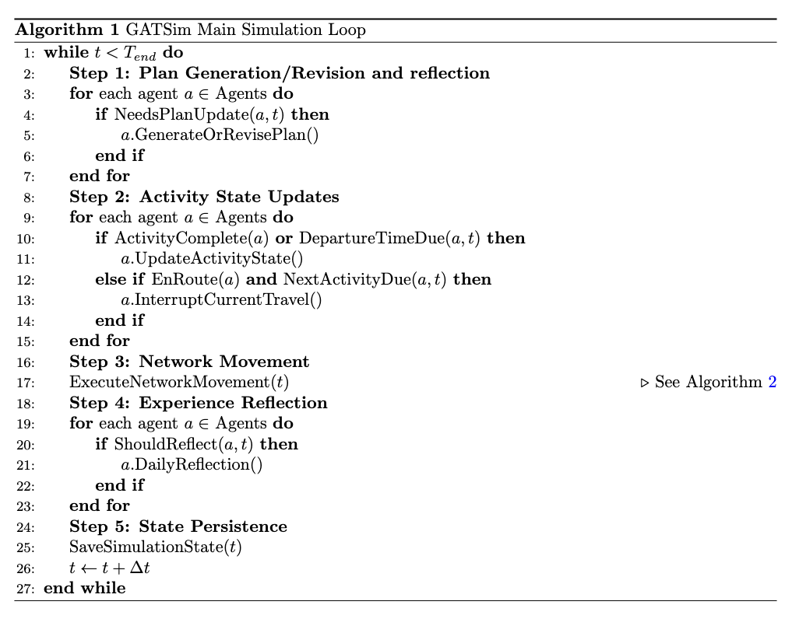
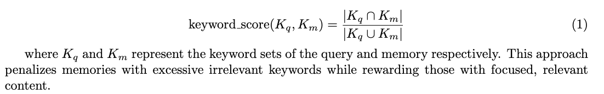
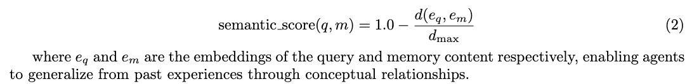
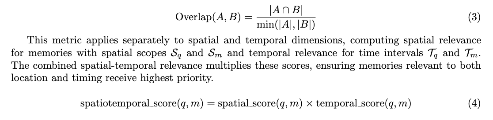
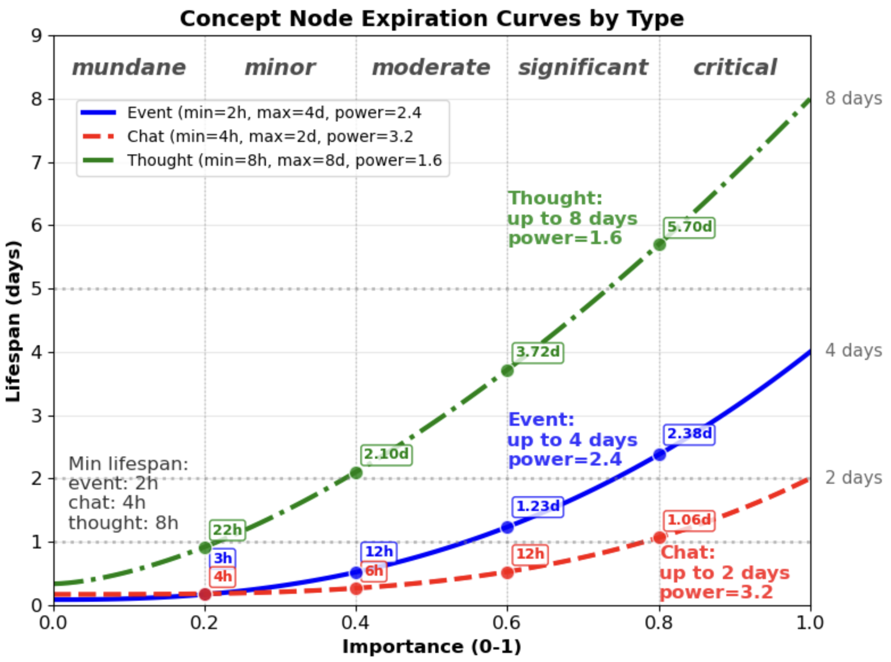
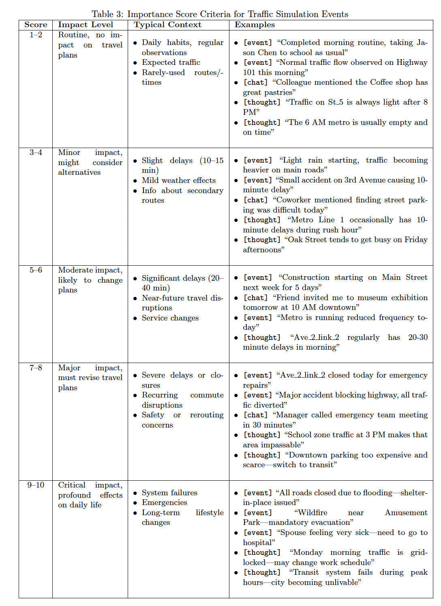
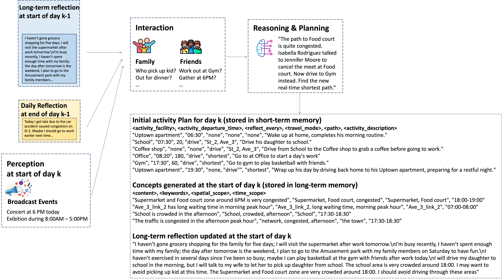
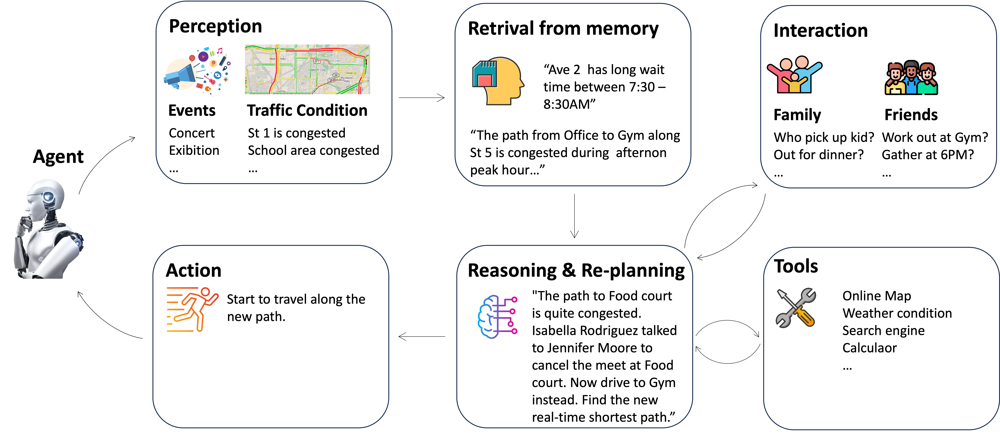
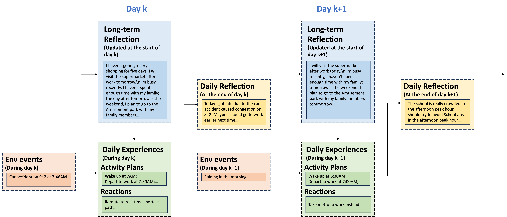

# Technical Highlights

## Framework
GATSim is a comprehensive framework for urban mobility simulation using LLM-based generative agents. The framework integrates three core components: 
- an Urban Mobility Foundation Model for population synthesis and behavior generation, 
- generative agents with cognitive architectures, and 
- a simulation environment that manages system dynamics and user interactions

## Simulation Process
The simulation operates through discrete-time orchestration of agent behaviors and system dynamics. Each timestep follows a structured sequence: plan generation and revision for adaptive replanning, activity state updates managing transitions between activities, mobility execution within the queue-based network, selective experience reflection for behavioral learning, and state persistence with time advancement. This cyclical process continues until reaching specified simulation horizons, typically 24 hours for daily studies or longer periods for behavioral adaptation analysis.

## Memory
- `Short-term memory` serves as the agent's working cognitive space, maintaining dynamically updated information for the current simulation day including activity plans, ongoing states, travel paths, and immediate perceptions.
- `Long-term memory` Long-term memory stores accumulated information across extended time horizons, forming the foundation for behavioral learning and adaptation.

**Memory Retrieval**

Keyword-based retrieval employs set-theoretic matching using the Jaccard similarity coefficient to identify memories with relevant keywords, supporting precise recall of specific events or locations. The Jaccard coefficient balances precision and recall by considering both intersection and union of keyword sets:

Semantic similarity retrieval leverages embedding-based search using FAISS (Facebook AI Similar-ity Search) for efficient vector-based operations. Content embeddings are generated using pre-trained language models, with semantic similarity computed as normalized cosine distance:

Spatial-temporal relevance retrieval addresses the inherently spatial-temporal nature of urban mobility decisions through specialized mechanisms. We adopt the Overlap Coefficient (Szymkiewicz–Simpson coefficient) for its desirable property that subset relationships yield perfect scores

The retrieval system also incorporates recency scoring through exponential decay modeling, recognizing that recent experiences often carry greater relevance for immediate decisions:

The final retrieval process integrates all scoring dimensions through configurable weighted combination. For each retrieval mode $r$, the system computes composite scores incorporating matching relevance, importance weights, and recency factors. The prototype employs weighted fusion by default, retrieving top-$k$ memories from each mode and re-scoring candidates using mode-specific weights before final selection. This multi-modal framework ensures agents can access relevant memories whether searching for specific locations, similar experiences, or contextually appropriate patterns, supporting sophisticated decision-making in urban mobility contexts.

**Forgetting Mechanism**

Realistic memory decay modeling prevents unbounded memory growth while reflecting psychological principles governing human memory retention. Each memory entry receives an expiration attribute determining its lifespan based on non-linear relationships with importance scores, reflecting the well-established principle that salient experiences persist longer than mundane ones \cite{anderson1991reflections, wixted1991form}. The importance score criteria is shown in \ref{tab:importance_score_criteria}.

The lifespan calculation employs power functions aligning with empirical findings on human memory retention:

**Importance Score Criteria**

## Perception
The perception system serves as the sensory interface between agents and their environment, gathering diverse information types that inform both planning and reactive decisions. The system operates through continuous monitoring of multiple information channels while employing intelligent filtering to manage cognitive load and focus attention on relevant stimuli.

- Spatial perception monitors nearby network events and conditions within the agent's immediate vicinity, enabling awareness of local traffic incidents, facility conditions, and other agents' activities. This localized awareness supports realistic behavioral responses to immediate environmental conditions while avoiding the computational overhead of global monitoring. The spatial perception radius adapts based on travel mode and activity context, reflecting the different awareness ranges associated with driving, transit use, and walking.

- Social perception maintains awareness of family member states, friend activities, and coworker conditions, enabling realistic social coordination and information sharing. This social awareness operates through relationship networks that determine information sharing patterns and trust levels, creating realistic information propagation dynamics that affect collective mobility behavior patterns.

- Broadcast perception receives system-wide announcements including weather alerts, major events, infrastructure disruptions, and public information campaigns. This information channel enables coordinated responses to large-scale events while modeling the realistic information dissemination patterns that occur through official communication channels.

## Planning
Long-term reflections encapsulate key personal experiences encompassing work-related tasks, social interactions, and family affairs while containing anticipations of upcoming events. These reflections serve as persistent behavioral context that evolves through experience accumulation, enabling agents to develop increasingly sophisticated planning strategies over time. Broadcast events represent shared external occurrences such as museum exhibitions, weather alerts, or infrastructure disruptions that create common awareness across the agent population, enabling realistic collective responses to major events.

The planning process incorporates social coordination through collaborative decision-making where agents may initiate conversations with relevant parties before finalizing plans. For instance, household members might discuss school pickup responsibilities or friends might coordinate post-work activities. These interactions model the cooperative decision-making processes fundamental to real-world mobility planning, where individual choices often depend on coordination with others. Conversation summaries are integrated into the planning context, ensuring social agreements influence final plan generation.

## Reactive behavior

## Reflection
The reflection system operates at multiple temporal scales to support both immediate adaptation and long-term learning, creating a comprehensive framework for behavioral development over time. This multi-scale approach mirrors human cognitive processes where immediate experiences inform short-term decisions while accumulated patterns shape long-term behavioral strategies. This emergent memory abstraction process is illustrated in Figure~\ref{fig:lt_memory}.

- Immediate reflection occurs during reactive decision-making, enabling agents to synthesize current conditions with past experiences to generate contextually appropriate responses. This reflection process creates concept nodes that capture the reasoning behind specific decisions, building a detailed history of decision-making contexts and outcomes that support future learning.

- Daily reflection processes synthesize experiences from completed simulation days, identifying patterns, successful strategies, and areas for improvement. These reflections create higher-level insights that transcend specific incidents, enabling agents to develop generalized knowledge about traffic patterns, route reliability, and mode effectiveness that inform future planning decisions.

- Long-term reflection maintains evolving summaries of behavioral patterns and preferences that persist across multiple simulation days. This reflection level enables the development of stable behavioral tendencies while maintaining flexibility for adaptation to changing conditions. The recursive updating process creates temporal continuity in agent cognition while supporting the gradual evolution of sophisticated mobility strategies.

## Parallel computing
Concurrent LLM call is supported to speed up the simulation process. Default concurrency is 8, namely at most 8 agents update their states concurrently. 

A single lock `_population_lock` is created at backend constructor and placed at long-term memory update (see `add_concept_node`) and cache file update (see `update_cache_concurrent_safe`) code blocks to prevent race conditions.

## Prompts
🧾 [complete prompt for initiating chat on a new day](initiate_chat_new_day_complete.md)

🧾 [complete prompt for generating response](generate_response_complete.md)

🧾 [complete prompt for generating chat summary](generate_chat_summary_complete.md)

🧾 [complete prompt for generating importance score](generate_importance_score_complete.md)

🧾 [complete prompt for generating activity plan on a new day](generate_activity_plan_complete.md)

🧾 [complete prompt for revising activity plan during the day](update_activity_plan_complete.md)

